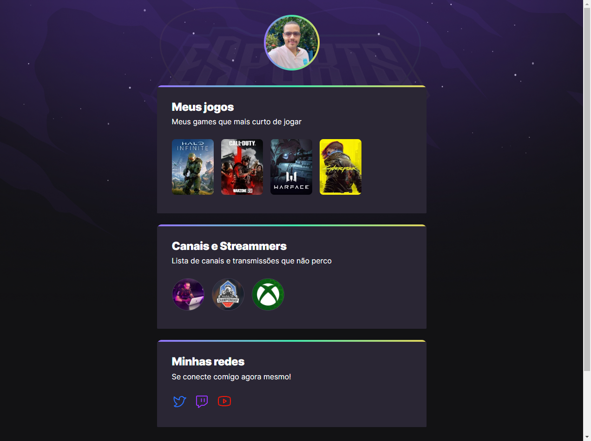

# NLW eSports

>Trilha Explorer

Projeto construído do evento Next Level Week da RocketSeat

🔗[Clique aqui para acessar](https://mathfrei.github.io/nlw-esports-explorer)

## ⚒️ Tecnologias

-  HTML
- CSS
- Github

## O que aprendi

- Alguns recursos a mais para realizar animações um pouco mais complexas (transform, translateX(), translateY() scale()).
- Um pouco de posicionamento de página (uso de calc()).
- Atributos CSS, como letter-spacing, line-height.
- Reforço no aprendizado de shorthand animation (animation-name,animation-duration, etc.) e de linear-gradient.
- Levantar website em Github.
- Alguns recursos do Visual Studio Code para poder publicar no Github.

## 📧 Contato

matheus_cfreitas@hotmail.com
matheuscfreitas97@gmail.com
https://www.linkedin.com/in/mathfrei/